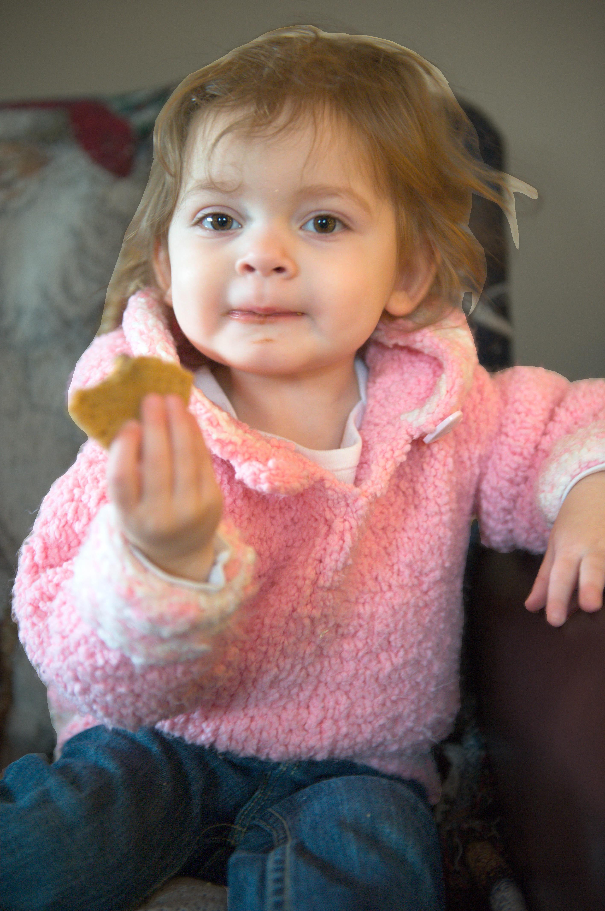
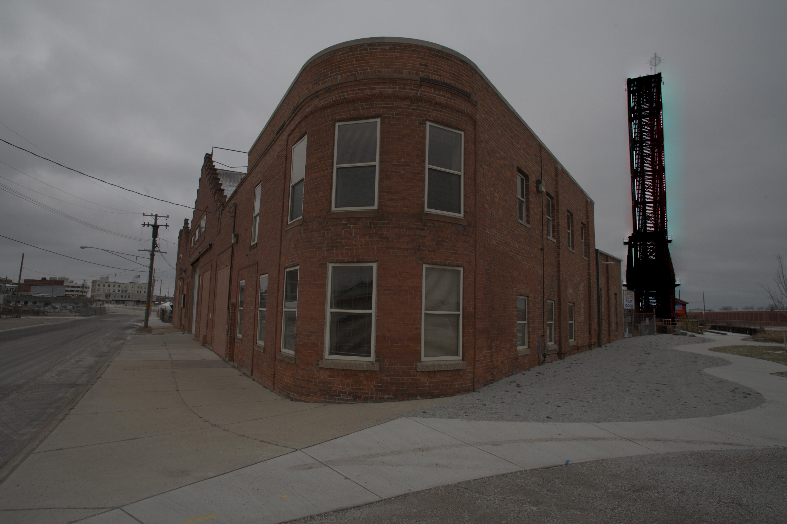
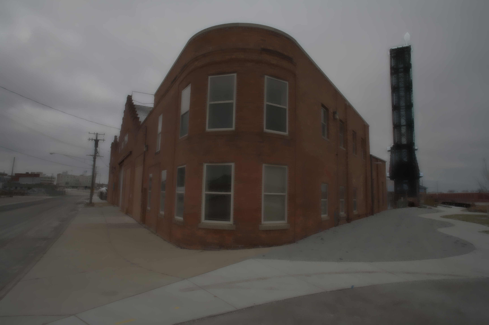
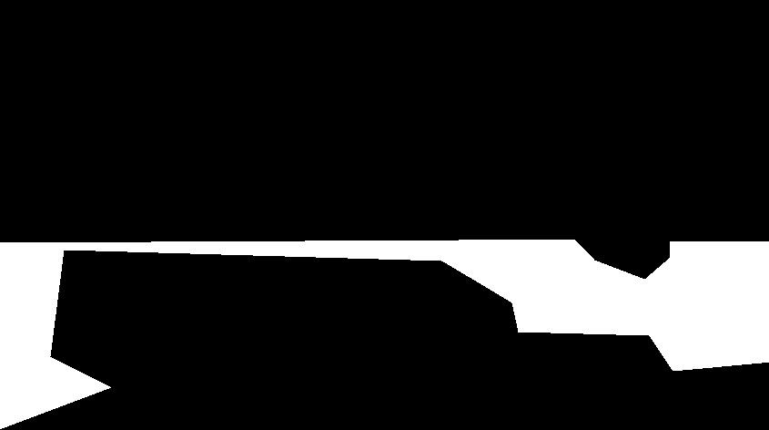
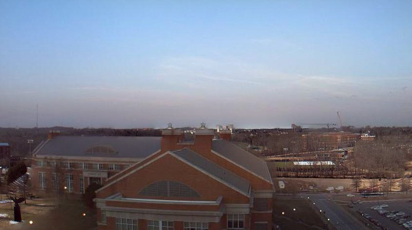

## Image Blending GUI

算法设计与分析课程project

一个能够进行图像融合的图形用户界面

简化版（仅保留泊松编辑功能）见：[Poisson Image Editing UI](https://github.com/Lllmmr/Poisson-Image-Editing-UI)

#### 参考内容

[Deep Image Harmonization](https://github.com/bcmi/Image_Harmonization_Datasets/tree/master/DIH)

[GP-GAN](https://github.com/wuhuikai/GP-GAN)

[Boundary Finding based Multi focus Image Fusion](https://github.com/uzeful/Boundary-Finding-based-Multi-focus-Image-Fusion)

[基于小波变换的多聚焦图像融合](https://blog.csdn.net/yuki_rain/article/details/56672421)

### 运行

运行该项目需要`python3`环境

并安装`pyqt5`,`pyqt5-tools`, `numpy`, `opencv`, `opencv-contrib` ,  `tensorflow`, `scikit-image` , `chainer`

```
$ pip install PyQt5 pyqt5-tools numpy opencv-python opencv-contrib-python tensorflow==1.14.0 scikit image chainer
```

（注：最好使用1.14.0版本的tensorflow，其他版本可能会存在问题）

并下载模型

[model](https://github.com/Lllmmr/Image-Blending-GUI/releases)

下载后，将目录下`blending_gan.npz`放到`GP_GAN_blending`文件夹中

将目录下`model`文件夹整个放到`deepimageharm`文件夹中

### 操作指南

#### 图片操作：

`File->Open->dst_img/src_img`加载目标（背景）图像

按住空格键不放，可以用鼠标左键对源图像位置进行拖动

使用鼠标滚轮可以对源图像进行缩放

使用鼠标左键圈出源图像要进行编辑的区域

单击鼠标右键可以取消对编辑区域的选择

将图片移动/缩放/选区完毕后，可以使用右侧的按键进行图像编辑

`File->Save As`将图像编辑的结果保存到本地

#### 按键及功能：

右侧上方按键为对各种图像编辑模式的选择，模式都选择完后，即可按右侧最下方`Poisson Image Editing`按键进行图像编辑

最上方三个选项`Normal`, `Mixed`, `Transfer`分别表示“正常”，“混合”和“特征转换”

混合模式可以进行图像中线条的迁移，例如将文字迁移到背景上

特征转换模式可以进行纹路特征的转换，例如橘子和梨表面的特征转换

第四个选项`Local Changes`表示利用泊松编辑对源图像进行局部的改动，该模式下目标图像和源图像为同一张，因此只显示通过`File->Open->src_img`加载的图像

在该模式下，还需至少选择`Flattening`, `Illumination`, `Color`中的至少一项（建议只选一项）

`Flattening`对图像的编辑区域做扁平化处理

`low`, `high`两个滑动条调整扁平化的参数

`Illumination`调整图像所选区域的亮度

`a`, `b`两个滑动条调整亮度变化的参数

`Color`改变所选区域的颜色

通过下方按键选择要变成的颜色，选中`Gray`可将背景变为灰色

#### 图像编辑方法：

通过右下方四个不同的按键使用不同的编辑方法

其中，除了泊松编辑以外不支持对编辑模式的调整

因此若在上方选择了`Local Changes`选项，则点击按键不会做出反应

`Laplacian Pyramids`方法是对泊松编辑的改进，效果无明显变化

`Deep Image Harmonization`对选区要求较高

`GT-GAN`适合对结构较为相近的风景照进行编辑

#### 拓展功能：

`File->Save Mask/Save Src`可将经过缩放、裁剪后的源图像及其单通道mask保存到本地，方便其他未加入GUI的算法获取ROI

#### 三种方法比较：

|                 mask                  |             copy-and-past             |                   possion                   |                            GP-GAN                            |                   DIH                   |
| :-----------------------------------: | :-----------------------------------: | :-----------------------------------------: | :----------------------------------------------------------: | :-------------------------------------: |
|                  |               |             |  |             |
|             |               |             |  |             |
|  |    |  |  |  |
|  |    |  |  |  |
|  |    |  |  |  |
|  |    |  |  |  |
|  |    |  |  |  |
|  |  |  |  |  |

#### 比较结果

**泊松编辑**： 主要关注在消除图像融合后的接缝上，在颜色差异很大是会出现不自然的情况，但总的来说泊松编辑效果不错。

**GP-GAN:** 在前两组对比中效果不错，可能由于图片重建过程的原因在一些例子中出现不自然的光斑，物体出现透明化情况。

**Deep Image Harmonization:** 由于使用的方法无法较好处理接缝，在物体抠的比较好的情况下表现尚可，图像分割现在已经不是一个很困难的问题。但这种方法仍存在分辨率的问题，即使采用引导滤波，恢复成原分辨率后仍可能产生模糊。

图像融合是一个很常见的操作，但它对于处理的要求非常高,对融合后的图像希望真实自然，当前方法可以给出不错的效果但是都存在着一些问题，未来还有很大的改进空间。

深度学习应用于图像融合也尝试了一些方法，但首先面临的一个问题就是如何找到合适的训练集，要给出一个数据量足够的精心融合的图像难度太大。我们看到上面两种方法中都在训练集和训练上采取了一些特殊处理，降低了对训练集的要求；其次是提取何种特征去表达图像融合程度。

### 其他

**多焦点图像融合**

除上述工作以外，该项目还尝试用泊松编辑进行多焦点图像融合（给定一组内容相同但焦点不同的图像，提取各自清晰部分并融合成新图像）的工作。为保持UI的主体性，此分支没有加入到UI中。

可直接下载`Multi-Focus Image Fusion`中相关代码进行测试。提供了两组对比结果供参考。

**比较结果**

泊松编辑：可以清晰保留焦点的内容，但是合成效果取决于手动选取区域的精细程度。

基于小波变换的方法：通过小波保留每个像素的信息，并按照自定方法进行选择，效果较好，但是因不断下采样，因此会丢失一些细节。

基于边界寻找的方法：焦点处的内容较好地得到保留，但是由于一些图像的边界分别不清晰，在边界处会有一定模糊，总体较好。